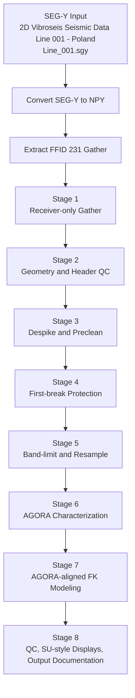

# AGORA Final FFID 231 Flowchart

This flowchart documents the processing sequence applied to `FFID 231` from **2D Vibroseis Seismic Data Line 001 - Poland**.

## Mermaid flowchart

## Linear stage description

1. Convert the raw SEG-Y line to `Line_001.npy`, `Line_001_twt.npy`, `Line_001_ffid.npy`, and `Line_001_tracf.npy`.
2. Extract the raw `FFID 231` shot gather and the receiver-only version.
3. Recover geometry from `SPS`, `RPS`, and `XPS`, then validate spacing and offsets.
4. Apply light precleaning before any protection or attenuation.
5. Protect first arrivals using a velocity-based taper.
6. Band-limit and resample the gather to the working sample rate.
7. Define the AGORA velocity and frequency search window.
8. Build a ground-roll model in FK space, then save QC figures, FK displays, arrays, and summary metrics.
