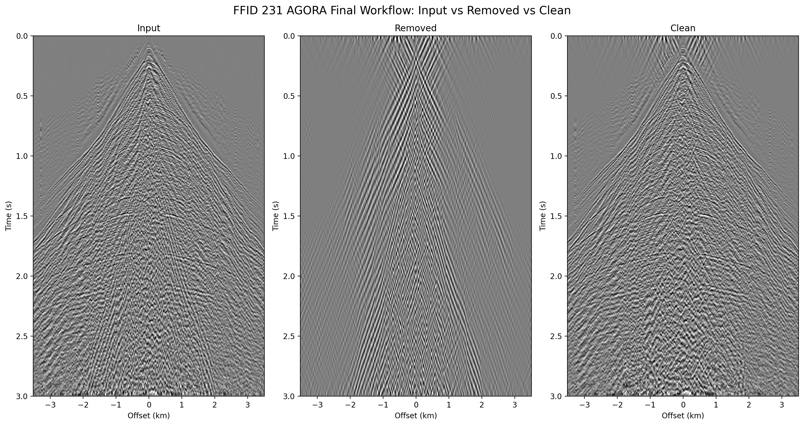
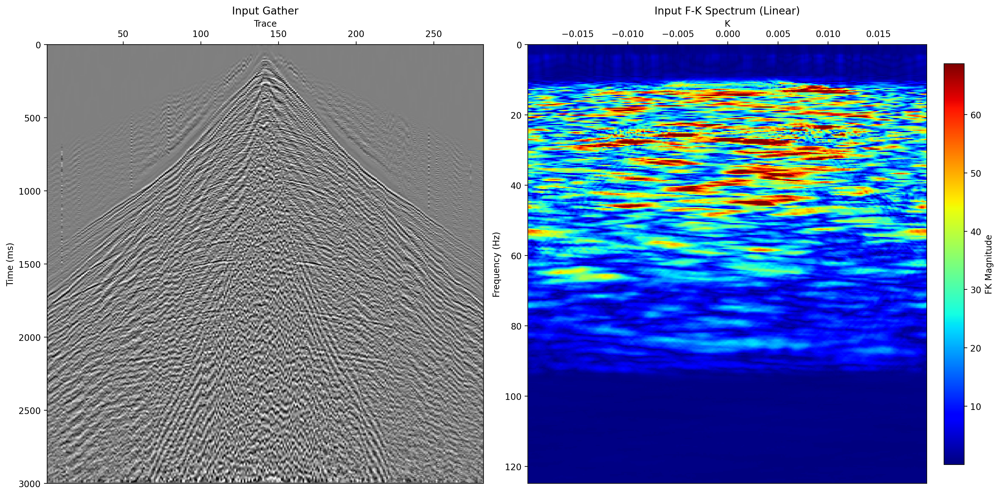
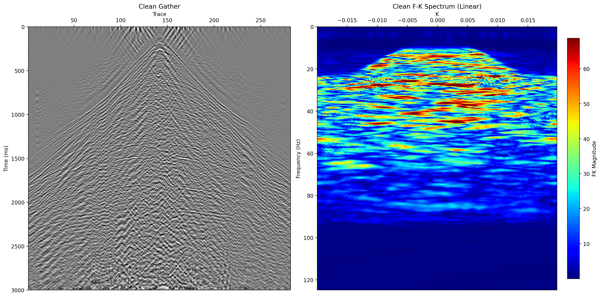
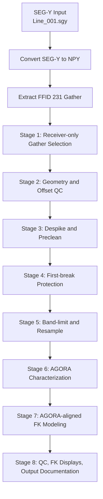

# AGORA Final FFID 231

AGORA-aligned 2D shot-domain seismic processing workflow for `FFID 231` from the dataset **2D Vibroseis Seismic Data Line 001 - Poland**. This repository packages the full workflow, from SEG-Y preparation to stage-by-stage QC outputs, in a form suitable for academic documentation and demonstration. The dataset designation follows the SEG Wiki entry for *2D Vibroseis Line 001*.

- Reference repository structure: https://github.com/arohatgi29/Seismic-Processing-using-Madagascar

## Table of contents

- Project overview
- Research objectives
- Data and acquisition
- Methodology
- Preview
- Data preparation
- Repository layout
- Processing flow
- Stage-by-stage summary
- Results summary
- Method limitations
- Citation
- Acknowledgement
- Inputs
- Outputs
- How to run
- Notes on implementation
- References

## Project overview

This workflow was prepared to:

1. document a clean and reproducible AGORA-aligned seismic ground-roll attenuation workflow,
2. provide a transparent processing sequence for final-project reporting,
3. export stage-by-stage visualizations for quality control and interpretation,
4. package the full demonstration as a GitHub-ready subproject.

The packaged workflow starts from the raw SEG-Y file:

1. convert `Line_001.sgy` to NumPy arrays,
2. export the time axis and trace-header information needed for QC,
3. extract the `FFID 231` gather,
4. run the 8-stage AGORA-aligned workflow on that extracted gather.

The processing is organized into eight stages:

1. Input gather and grouping
2. Geometry and header QC
3. Preclean
4. First-break protection
5. Band-limit and resampling
6. AGORA characterization
7. FX/FK-style modeling and back-scatter cleanup
8. Final QC and output documentation

## Research objectives

This repository was prepared to support final-project documentation with the following objectives:

1. document a reproducible ground-roll attenuation workflow for a 2D land vibroseis dataset,
2. prepare a traceable sequence from raw SEG-Y data to processed `FFID 231` output,
3. provide QC figures that can be used in methodology and results chapters,
4. package the workflow in a form suitable for publication and version control.

## Data and acquisition

The input data used in this study correspond to **2D Vibroseis Seismic Data Line 001 - Poland**, stored in SEG-Y format. In this repository, the processing focus is limited to a single field file identifier, namely `FFID 231`, in order to document the workflow in a controlled and traceable manner.

Dataset reference:

- SEG Wiki: [2D Vibroseis Line 001](https://wiki.seg.org/wiki/2D_Vibroseis_Line_001?__cf_chl_tk=1rDpf1oxcwWe2wx4BtOPEzwIA94NbPtyy0XZm4faGDk-1776780184-1.0.1.1-AypPTVQ5v08T6CTMnYb5yn_gm.goBGqcxoEHUtI68ac)

The acquisition support files used in the workflow are:

- `Line_001.sgy` for seismic traces from 2D Vibroseis Seismic Data Line 001 - Poland
- `Line_001.SPS` for source geometry
- `Line_001.RPS` for receiver geometry
- `Line_001.XPS` for field-record and channel mapping

The extracted working gather contains:

- `284` traces in the raw shot gather
- `282` receiver traces after excluding non-receiver channels
- sampling interval `2 ms` before resampling

## Methodology

The methodological framework in this repository follows an AGORA-aligned prestack workflow for land seismic ground-roll attenuation. The sequence begins with seismic data preparation from SEG-Y format, followed by gather selection, geometry recovery, trace conditioning, first-break protection, frequency conditioning, FK-based characterization, and ground-roll modeling.

From an implementation perspective, the workflow can be grouped into four methodological blocks:

1. data preparation: conversion of the SEG-Y line into numerical arrays and extraction of `FFID 231`;
2. geometric conditioning: reconstruction of source-receiver geometry and signed offsets from `SPS`, `RPS`, and `XPS`;
3. signal conditioning: despiking, trace balancing, early-arrival protection, band-limiting, and resampling;
4. coherent-noise attenuation: AGORA-aligned characterization and FK-domain modeling to estimate and remove ground-roll energy.

The final stage produces processed gathers and documentation-quality QC products, including stage-specific images, FK-domain displays, summary metrics, and array outputs.

## Preview

Example outputs from the final documentation stage are shown below.

### Final gather panels



### SU-style input gather and corresponding FK spectrum



### SU-style clean gather and corresponding FK spectrum



## Data preparation

Before running the AGORA workflow, prepare the local NumPy assets from the raw SEG-Y:

```bash
python agora_final_ffid231/prepare_data_ffid231.py
```

This script will:

- read `../2D_Land_vibro_data_2ms/Line_001.sgy`
- convert the full line to `Line_001.npy`
- export `Line_001_twt.npy`
- export per-trace `ffid` and `tracf`
- extract `FFID 231` only
- save both raw and receiver-only `FFID 231` arrays

Prepared outputs are written under:

- [data/prepared](./data/prepared)

## Repository layout

```text
agora_final_ffid231/
|- .gitignore
|- FLOWCHART.md
|- LICENSE
|- README.md
|- RELEASE_NOTES_v1.md
|- requirements.txt
|- config/
|  `- agora_final_ffid231_config.json
|- data/
|  `- prepared/
|     |- ffid_231_raw.npy
|     |- ffid_231_receiver_only.npy
|     |- ffid_231_twt.npy
|     |- ffid_231_tracf.npy
|     `- *.json
|- prepare_data_ffid231.py
|- run_agora_final_ffid231.py
`- results/
   `- agora_final_ffid_231/
      |- stage_1_*.png
      |- stage_2_*.png
      |- ...
      `- stage_08_*.png/.npy/.json
```

## Processing flow

The full flowchart is available in [FLOWCHART.md](./FLOWCHART.md).



## Stage-by-stage summary

### Stage 1. Input gather and grouping

- Reads prepared `FFID 231` context derived from the raw `Line_001.sgy`
- Drops non-receiver traces using `tracf > 0`
- Produces receiver-only gather for processing

### Stage 2. Geometry and header QC

- Parses `SPS`, `RPS`, and `XPS`
- Computes signed offsets
- Checks receiver spacing consistency
- Saves geometry and offset QC plots

### Stage 3. Preclean

- Optional trace despiking
- Per-trace demeaning
- Prepares amplitude-preserved gather for protection stage

### Stage 4. First-break protection

- Applies a velocity-based protection taper similar in spirit to `WMUTEX`
- Supports a configurable mute option when stricter early-time attenuation is required

### Stage 5. Band-limit and resampling

- Applies band-pass filtering
- Resamples `2 ms -> 4 ms`
- Produces the working gather used by the AGORA-aligned stage

### Stage 6. AGORA characterization

- Stores and visualizes the target velocity-frequency window
- Includes `FMIN`, `FMAX`, `VGMIN`, `VGMAX`, `VPMIN`, `VPMAX`

### Stage 7. AGORA-aligned modeling

- Uses a geometry-aware FK apparent-velocity mask
- Produces:
  - removed ground-roll estimate
  - clean gather
  - FK mask

### Stage 8. QC and output documentation

- Saves final AGC panels
- Saves SU-style `x-t` and `f-k` pairs
- Saves shared-scale linear and log FK views
- Saves summary metrics and stage-by-stage documentation outputs

## Results summary

The workflow generates a complete processing record for `FFID 231`, including intermediate-stage visualizations and final-stage output diagnostics. The final outputs include:

- processed gather panels in the time-offset domain,
- FK-domain visualizations before and after attenuation,
- stage-specific QC plots from data preparation through AGORA-aligned attenuation,
- numerical outputs in `.npy` format for further analysis,
- a summary JSON file containing geometry, processing, and amplitude metrics.

The main summary file is:

- [stage_08_agora_final_summary.json](./results/agora_final_ffid_231/stage_08_agora_final_summary.json)

This file records:

- trace counts and geometry checks,
- stage configuration snapshots,
- RMS and energy-removal metrics,
- FK display scaling values,
- auxiliary time-frequency comparison metrics used for interpretation support.

## Method limitations

This workflow should be interpreted with the following limitations in mind:

1. the implementation is AGORA-aligned, but it is not the proprietary CGG AGORA engine;
2. the documented example is restricted to `FFID 231`, so conclusions should not be generalized to the entire survey without broader testing;
3. the FK-domain attenuation is sensitive to geometry assumptions, especially receiver spacing and apparent-velocity limits;
4. the output quality depends on the suitability of selected parameters such as `FMIN`, `FMAX`, `VGMIN`, `VGMAX`, and the first-break protection settings;
5. while the workflow is reproducible and documented, parameter transfer to other lines or surveys may require recalibration.

## Citation

If you use this repository as part of academic work, please cite it in a form similar to:

```text
claramtd, 2026, AGORA Final FFID 231:
AGORA-aligned 2D shot-domain seismic processing workflow for
2D Vibroseis Seismic Data Line 001 - Poland, GitHub repository.
https://github.com/claramtd/agora-final-ffid231
```

You may also cite the dataset separately using the SEG Wiki entry listed in the References section.

## Acknowledgement

This repository acknowledges:

- the SEG Wiki entry for the dataset description and contextual reference,
- the open Madagascar-based seismic processing example repository used as a structural inspiration for documentation layout,
- the AGORA user-guide discussion used to frame the processing stages and parameterization logic.

## Inputs

This subproject expects the dataset already present in the parent repository:

- `../2D_Land_vibro_data_2ms/Line_001.sgy` from **2D Vibroseis Seismic Data Line 001 - Poland**
- `../2D_Land_vibro_data_2ms/Line_001.SPS`
- `../2D_Land_vibro_data_2ms/Line_001.RPS`
- `../2D_Land_vibro_data_2ms/Line_001.XPS`

The subproject can generate its own local prepared `.npy` files from the SEG-Y input using:

- [prepare_data_ffid231.py](./prepare_data_ffid231.py)

## Outputs

By default, outputs are written to:

- [results/agora_final_ffid_231](./results/agora_final_ffid_231)

Key deliverables include:

- `stage_1_raw_vs_receiver_only.png`
- `stage_2_geometry_map.png`
- `stage_3_preclean_before_after.png`
- `stage_4_first_break_protection_mask.png`
- `stage_5_filtered_vs_resampled.png`
- `stage_6_agora_characterization.png`
- `stage_7_modeling_removed_clean.png`
- `stage_08_agora_final_summary.json`
- `stage_08_*_su_style_xt_fk_linear.png`

## How to run

From the repository root:

```bash
python agora_final_ffid231/prepare_data_ffid231.py
python agora_final_ffid231/run_agora_final_ffid231.py
```

Or from inside the subproject:

```bash
cd agora_final_ffid231
python prepare_data_ffid231.py
python run_agora_final_ffid231.py
```

## Notes on implementation

- This is an **AGORA-aligned approximation** implemented in Python.
- It follows the stage structure and parameter logic discussed from the AGORA user guide, but it is **not** the proprietary CGG AGORA engine itself.
- The workflow is designed to be transparent, reproducible, and easy to tune from JSON configuration.

## References

- Madagascar-style processing reference:
  https://github.com/arohatgi29/Seismic-Processing-using-Madagascar
- Dataset reference:
  https://wiki.seg.org/wiki/2D_Vibroseis_Line_001?__cf_chl_tk=1rDpf1oxcwWe2wx4BtOPEzwIA94NbPtyy0XZm4faGDk-1776780184-1.0.1.1-AypPTVQ5v08T6CTMnYb5yn_gm.goBGqcxoEHUtI68ac
- AGORA user-guide discussion basis:
  https://www.scribd.com/document/873195910/Agora
